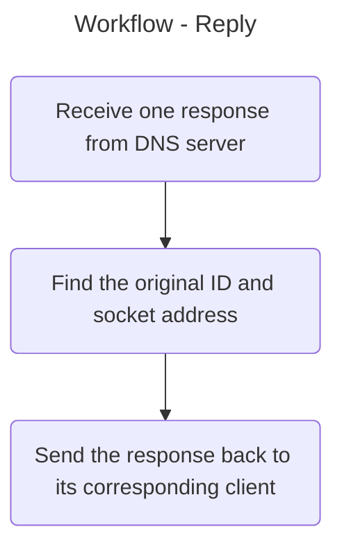
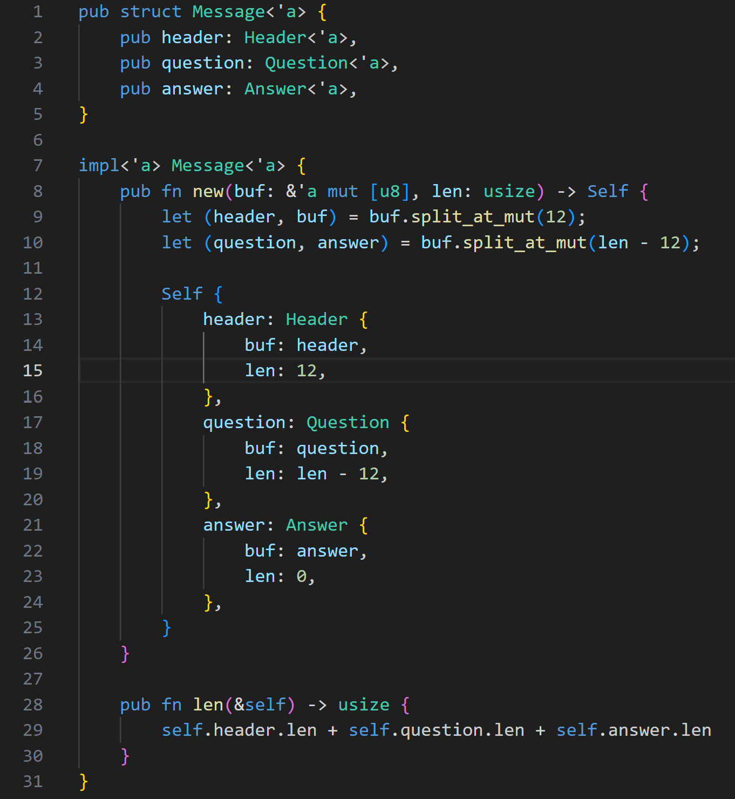
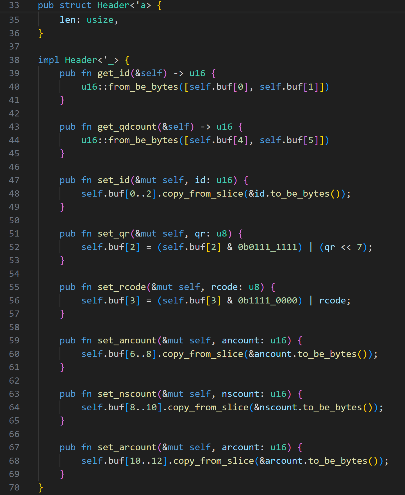
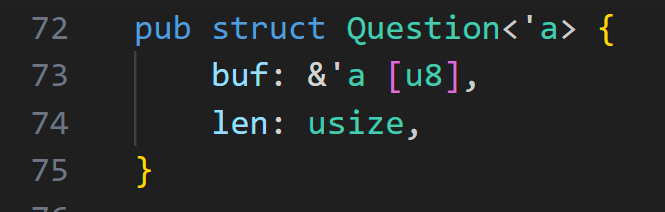
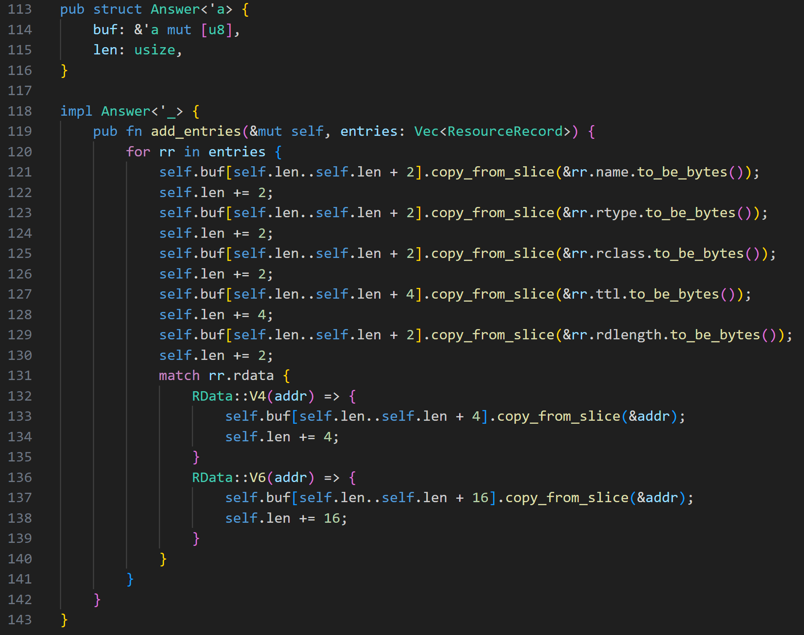
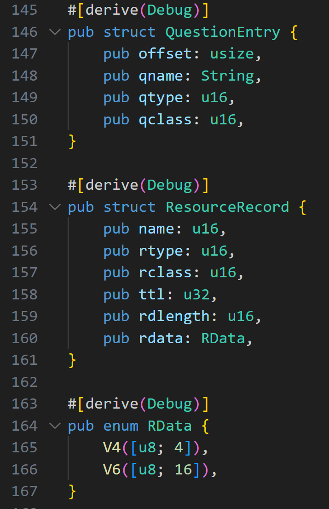
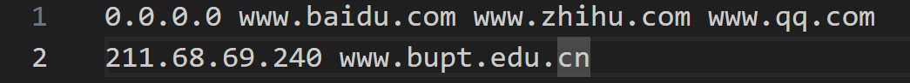
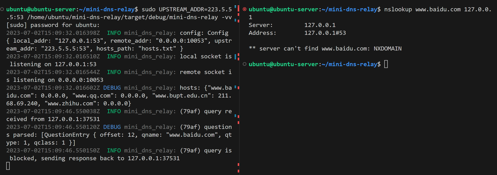
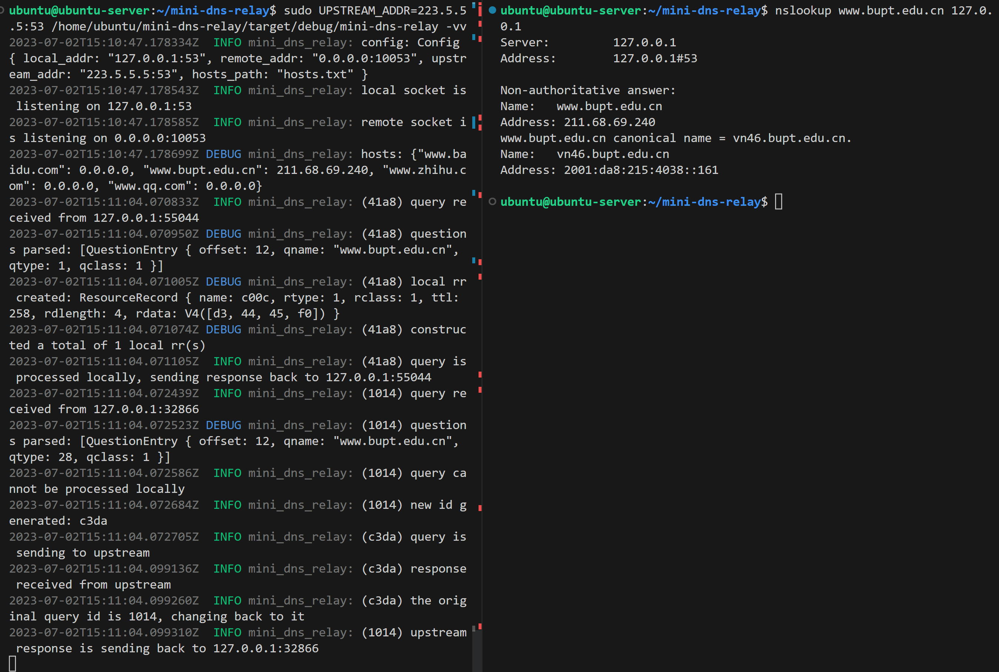
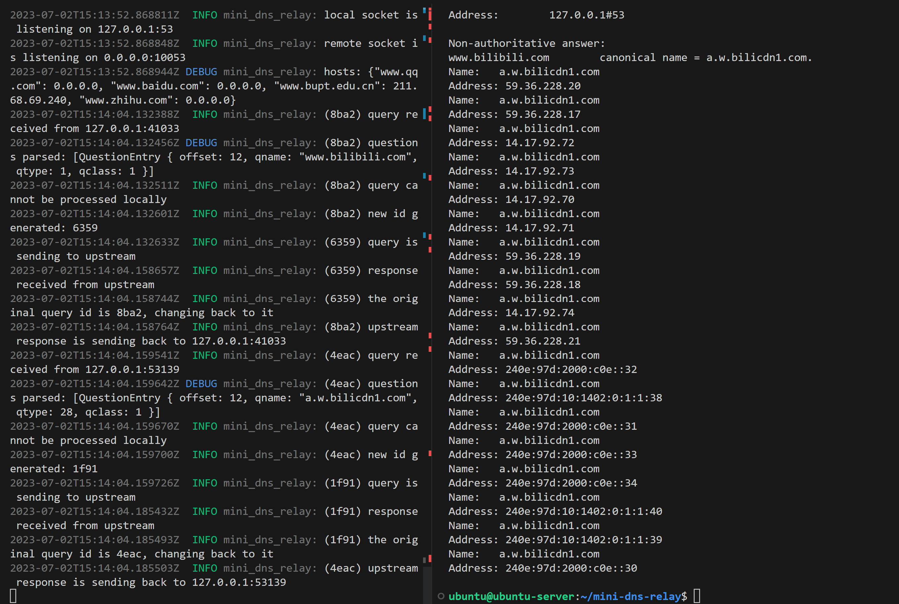

# DNSRelay - Group 24

## Overview

###  Brief Requirements

Implement a DNS relay that:
- Receives DNS queries from DNS client (Resolver) and forwards them to a given DNS server.
- Receives DNS responses from DNS server and forwards them to the Resolver. There are 3 different cases we need to handle.

The relay should implement the following three requirements:
- For domain name included in the local database (e.g., dnsrelay.txt), it sends back corresponding IP addresses.
- If found, for IP address 0.0.0.0, it sends back “no such name” (reply code =0011).
- For domain name not included in the database, it forwards query to local DNS server.

### Target

One of the targets is to gain a deeper understanding of how the Domain Name System (DNS) works and, specifically, to learn about the process of resolving domain names to IP addresses, which is a fundamental aspect of how the internet functions. By hands-on experience working with DNS queries and responses, we can learn about DNS caching and how it can be used to improve the performance of DNS resolution. By implementing a DNS relay in Rust, we will have the opportunity to learn how to work with Rust's syntax and data types, as well as its concurrency model. Rust has a strong focus on safe and efficient concurrency, which makes it a great choice for building networked applications like a DNS relay.

## Requirements Analysis

### Development Environment

- Operating system: Linux
- Programming language: Rust

### Detailed Requirements

On startup, the program should read environmental variables, user arguments and the local file. It also opens a new socket and binds to port 53 for DNS service. Upon receiving queries from client, the program parses the packet and extract useful information for further process, such as the query name and offset of the question. The local file is looked up for cache hit and blacklist blocking. If all questions in the query can be processed without consulting the upstream DNS server, a reply consisting of one or multiple answers is constructed and sent to the clients. Otherwise, the query packet is forwarded to the upstream DNS server. A map is added associating the upstream ID, the client ID and their sockets on the Internet. When receiving a reply from the upstream DNS, its content is used to update the local cache, and its ID is mapped to the client ID so that the reply can be forwarded back to the client.

## Design

Generally speaking, there are two loops running asynchronously, namely 'forward' and 'reply'. The following diagrams show the their workflows.

### Flow Chart

### Data Structure

Struct Message comprises a header, a question, and an answer struct. All three types of struct consist of a byte buffer and the length of the buffer. Methods such as get_id() and add_entries() are implemented to manipulate the data structures.

Struct QuestionEntry is comprised of an offset, a qname, a qtype and a qclass. It is used to construct the answer part of the reply to clients. The offset points to the starting bit of the qname in the question section in the client query. The qname is the query string. The qtype field is used to specify the type of resource record being requested. Common types include A records (which map domain names to IP addresses), MX records (which specify the mail server for a domain), and NS records (which specify the authoritative name server for a domain). The qclass field is used to specify the class of the resource record being requested. This is typically set to IN, which indicates that the record is part of the Internet class.

Struct ResourceRecord contains all information stored in the local file and needed to construct the reply packet. It includes a name, a rtype, a rclass, a ttl, a rdlength, and a rdata. The name is strored as a two bytes unsigned integer as a pointer to the starting bit of the corresponding question. The rdata is the answer to a question in the client query packet.

## Results

Hosts:

### Blacklist

As shown in the hosts.txt, www.baidu.com is blocked in the blacklist, so the program returned a NXDOMAIN, indicating that the domain did not exist.

### Local Record Matching

www.bupt.edu.cn exists as an entry in hosts.txt, so the relay successfully matched the local record and returned the recorded A answer 211.68.69.240.

### Upstream Forwarding

www.bilibili.com was not found in the hosts. Therefore, the program forwarded the packet to upstream DNS server after doing a id mapping. After receiving the reply from the upstream, it forwarded back to the client.

## Conclusion

The implementation of a DNS relay is a challenging and rewarding project that provides a valuable learning experience in network programming. Through this project, we have gained a deeper understanding of the Domain Name System (DNS) and how it facilitates internet communication by resolving domain names to IP addresses.

Our implementation of the DNS relay in Rust allowed us to learn and improve our skills in this modern systems programming language. Rust's features and focus on safe and efficient concurrency made it an excellent choice for building a networked application like a DNS relay.

Throughout the implementation process, we faced a number of challenges, including working with DNS queries and responses, and implementing the blacklist and local caching functions. However, through a methodical approach to problem-solving and careful consideration of system design, we were able to overcome these challenges and produce a functional and reliable DNS relay with advanced features.

Nevertheless, the DNS relay can use some improvements to enhance robustness and efficiency. For example, more async operations for cache query and updating can be added to achieve partial query of client questions. This way, DNS queries with multiply questions from clients won't be forward or blocked as a whole if only some of the questions miss the cache or are blocked.

Overall, this project has provided us with valuable experience in network programming, Rust development, and system design. The inclusion of the blacklist and local caching functions has further enhanced our understanding of the importance of security and optimization in networked applications. We are proud of our implementation of the DNS relay with advanced features and believe it serves as a testament to our skills and expertise in these areas.
