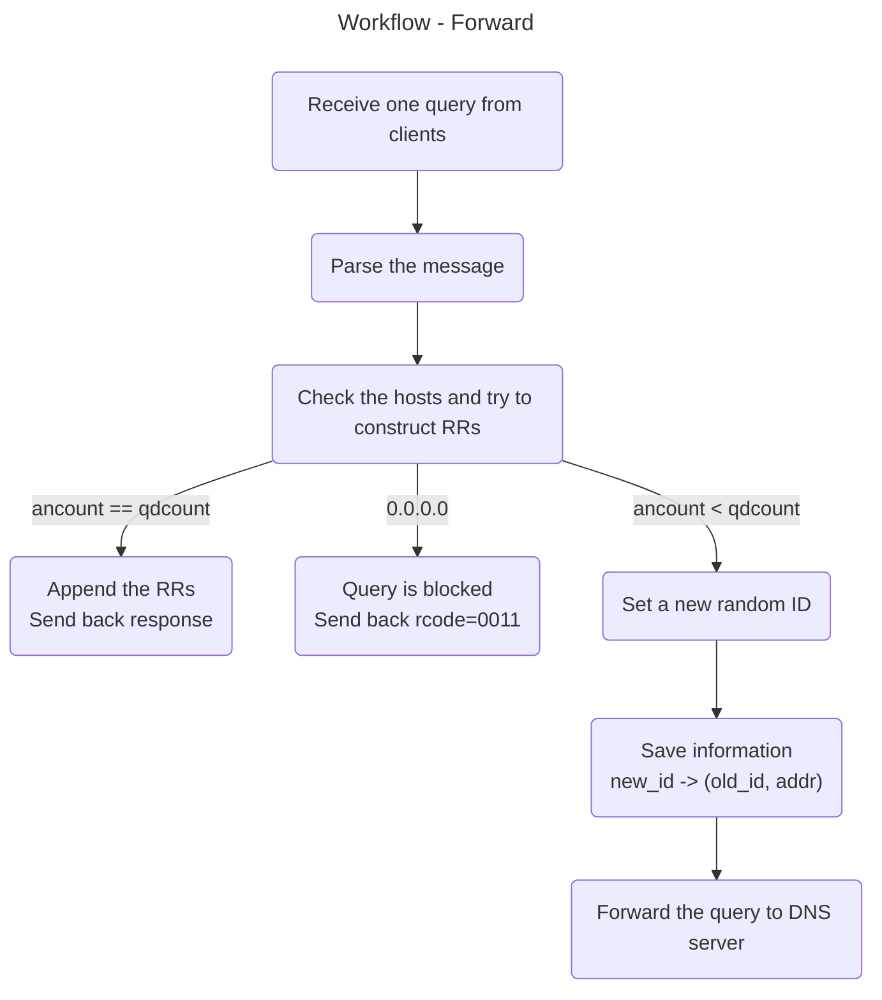
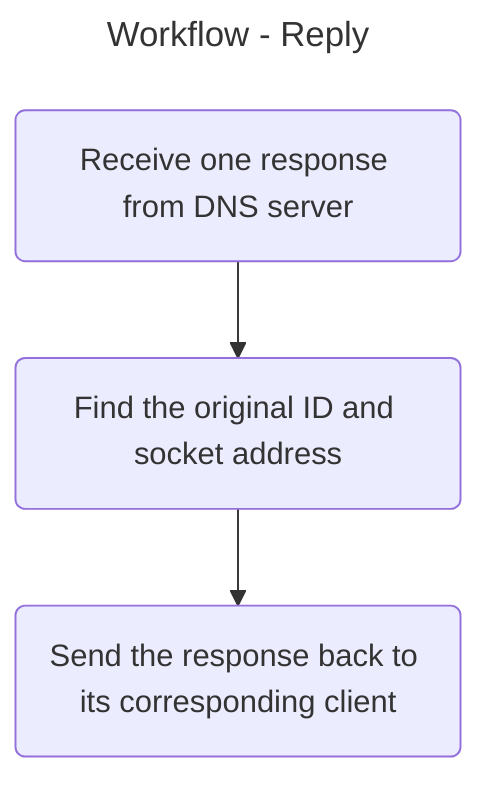

# DNSRelay - Group 24

> Group Members: Tiantian Li, He Zhu, Tianyi Yang

## Overview

###  Brief Requirements

Implement a DNS relay that:

- Receives DNS queries from DNS clients and forwards them to a given DNS server.
- Receives DNS responses from the DNS server and forwards them to the clients.

There are 3 different cases we need to handle:

- For domain name included in the local database (e.g., hosts.txt), it sends back the corresponding IP addresses.
- If found, for IP address 0.0.0.0, it sends back "no such name"(reply code=0011).
- For domain name not included in the database, it forwards the query to the DNS server.

### Target

One of the targets is to gain a deeper understanding of how the Domain Name System (DNS) works and, specifically, to learn about the process of resolving domain names to IP addresses, which is a fundamental aspect of how the Internet functions.

By implementing a DNS relay in Rust, we will have the opportunity to learn how to work with Rust's syntax and data types, as well as its concurrency model. Rust has a strong focus on safe and efficient concurrency, which makes it a great choice for building network applications such as a DNS relay.

## Requirements Analysis

### Development Environment

- Operating system: Arch Linux
- Programming language: Rust 1.70.0

### Detailed Requirements

On startup, the program should read environmental variables, command line arguments and the local hosts file. It also opens two `UdpSocket`s: one for communicating with clients, one for communicating with upstream DNS server.

Upon receiving queries from clients, the program parses the packet and extract useful information for further processing. The hosts file is checked for local answer construction and blacklist blocking.

If all questions in the query can be processed without consulting the upstream DNS server, a reply consisting of one or multiple answers is constructed and sent to the clients. Otherwise, the query packet is forwarded to the upstream DNS server.

## System Design

Generally speaking, there are two loops running **asynchronously**, namely '**forward**' and '**reply**'. The following diagrams show the their workflows.

### Flow Chart





### Module Decomposition

The application consists of three parts serving different functionalities:

- `main.rs` - the entry of the program
- `lib.rs` - the business logic, including the two workflows mentioned above configuration reading
- `packet.rs` - the homemade wrappers for DNS packets

### Data Structures

Struct `Message` comprises a header, a question, and an answer struct. All three types of struct consist of a mutable reference to a byte buffer and the length of the buffer. Methods such as `get_id()` and `add_entries()` are implemented to manipulate the underlying data.

```rust
pub struct Message<'a> {
    pub header: Header<'a>,
    pub question: Question<'a>,
    pub answer: Answer<'a>,
}
```

Struct `QuestionEntry` is comprised of an offset, a qname, a qtype and a qclass. It is used to represent the parsed version of entries in the question section.

The offset points to the starting byte of the qname. The qname is the query string. The qtype field is used to specify the type of resource record being requested. Common types include A records (which map domain names to IP addresses), MX records (which specify the mail server for a domain), and NS records (which specify the authoritative name server for a domain). The qclass field is used to specify the class of the resource record being requested. This is typically set to IN, which indicates that the record is part of the Internet class.

```rust
pub struct QuestionEntry {
    pub offset: usize,
    pub qname: String,
    pub qtype: u16,
    pub qclass: u16,
}
```

Struct `ResourceRecord` contains the information needed to construct the reply packet. It includes a name, a rtype, a rclass, a ttl, a rdlength, and a rdata. The name is stored as a pointer for message compression.

```rust
pub struct ResourceRecord {
    pub name: u16,
    pub rtype: u16,
    pub rclass: u16,
    pub ttl: u32,
    pub rdlength: u16,
    pub rdata: RData,
}

pub enum RData {
    V4([u8; 4]),
    V6([u8; 16]),
}
```

## Testings and Results

Sample hosts file:

```
# ./hosts.txt
0.0.0.0 www.baidu.com www.zhihu.com www.qq.com
211.68.69.240 www.bupt.edu.cn
```

### 1. Blacklist

As shown in the `hosts.txt`, `www.baidu.com` is blocked with an address of `0.0.0.0`.

The program responded with a `NXDOMAIN`, indicating that the domain does not exist.


### 2. Local Record Matching

`www.bupt.edu.cn` exists as an entry in hosts.txt, so the relay server successfully constructed a local resource record and returned the recorded A answer `211.68.69.240`.

The AAAA query which cannot be processed locally is forwarded to the upstream.


### 3. Upstream Forwarding

`www.apple.com` was not found in the hosts. Therefore, the program forwarded the packet to upstream DNS server. After receiving the reply from the upstream, the server forwarded the response back to the client.


## Conclusion and Future Improvements

The implementation of a DNS relay is a challenging and rewarding project that provides a valuable learning experience in network programming. Through this project, we have gained a deeper understanding of the Domain Name System (DNS) and how it facilitates internet communication by resolving domain names to IP addresses.

Our implementation of the DNS relay in Rust allowed us to learn and improve our skills in this modern systems programming language. Rust's features and focus on safe and efficient concurrency made it an excellent choice for building a network application such as a DNS relay.

Throughout the implementation process, we faced a number of challenges, including working with DNS queries and responses. However, through a methodical approach to problem-solving and careful consideration of system design, we were able to overcome these challenges and produce a functional and reliable DNS relay server.

There are several possible future improvements that can be employed in this system. For example, a fast and reliable caching system can be implemented so that the network consumption for upstream link can be greatly reduced. It could be very tricky as this involves cache time design, and possibly recursive searching. We decided to not include a cache in this system because we think a unreliable cache is pretty much redundant and may cause a significant drop of performance.

Overall, this project has provided us with valuable experience in network programming, Rust development, and system design.
